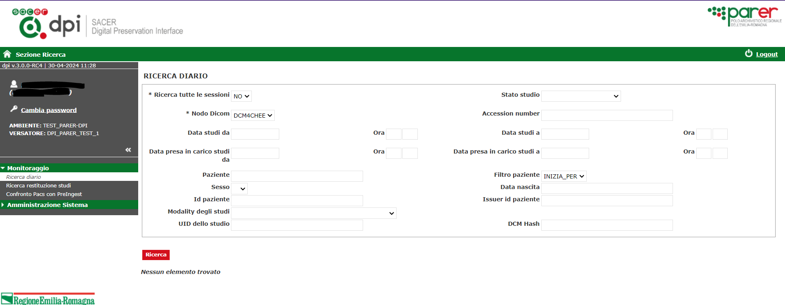
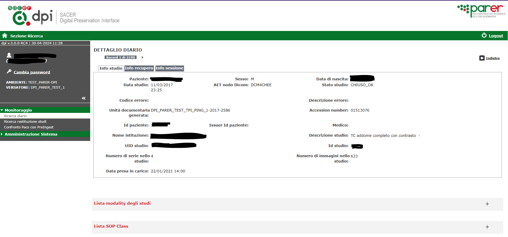
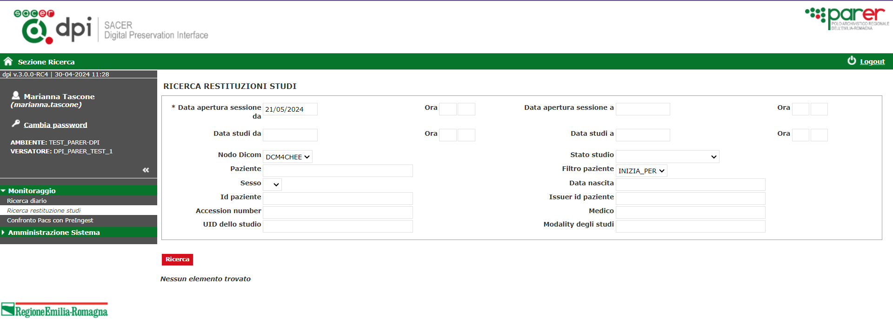
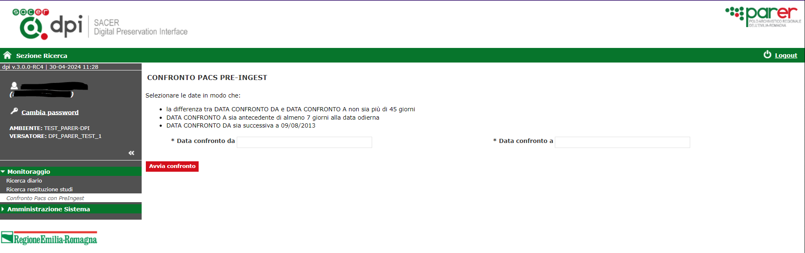

# DPI (Digital Preservation Interface)

Fonte template redazione documento:  https://www.makeareadme.com/.


# Descrizione

Il modulo software DPI (Digital Preservation Interface), sviluppato e manutenuto dall’Amministrazione, consiste in un sistema di interfaccia tra i sistemi dell’Ente produttore e PING che può essere installato sia all’interno della rete del Sistema di conservazione, sia all’interno della rete del Produttore dove può essere gestito secondo le sue politiche di sicurezza e autenticarsi sul suo IdP.  


# Installazione

Requisiti minimi per installazione: 

- Sistema operativo : consigliato Linux server (in alternativa compatibilità con Windows server);
- Java versione 8 (OpenJDK / Oracle);
- Tomcat 9.
  
## Instalazione JDK 

Consigliata adozione della OpenJDK alla versione 11, guida all'installazione https://openjdk.org/install/.

## Connettività

Il server su cui è installato il DPI deve essere abilitato a raggiungere gli host che ospitano determinati servizi esposti in Internet. Deve essere possibile raggiungere un server ftp e gli URL che espongono i contesti applicativi che occorrono al corretto funzionamento del DPI alle porte specificate, ad esempio:
- host: ftp-parer.regione.emilia-romagna.it porte: 21, 60000 - 60100 (ftps)
- host: parer.regione.emilia-romagna.it porta: 443 TCP (https)
- host: parer-pre.regione.emilia-romagna.it  porta: 443 TCP (https)

E' consigliata la disponibilità di un DNS per la risoluzione degli indirizzi specificati.

Il DPI necessita inoltre di comunicare con il PACS e viceversa tramite protocollo TCP/DICOM. 

Solitamente vengono utilizzate le porte 104 (DPI --> PACS) e 11112 (PACS --> DPI).

L’IP del PACS varia a seconda dell'installazione e deve essere comunicato di volta in volta.

## Setup application server (Tomcat 9)

Installare Tomcat 9 all'ultimo update disponibile.

Abilitare il connettore https.

### Settaggio variabili d’avvio JVM Tomcat

Nelle installazioni di test sono state utilizzate le seguenti configurazioni di system.d. 

In particolare, si riporta un esempio del file tomcat-dpi-AMBIENTE.service presente nella directory /etc/systemd/system/ . Il valore di AMBIENTE viene comunicato in fase di installazione.

Contenuto del file:

```
[Unit]
Description=Apache Tomcat 9 DPI AMBIENTE
After=syslog.target

[Service]
User=tomcat
Group=tomcat
UMask=0002
TimeoutSec=5m
WorkingDirectory=/opt/tomcat/tomcat-dpi-AMBIENTE/

Environment="JAVA_HOME=/usr/lib/jvm/java-1.8.0-openjdk"
Environment="CATALINA_BASE=/opt/tomcat/tomcat-dpi-AMBIENTE"
Environment="CATALINA_HOME=/opt/tomcat/tomcat-dpi-AMBIENTE"
Environment="CATALINA_PID=/opt/tomcat/tomcat-dpi-AMBIENTE/tomcat.pid"
Environment="CATALINA_OPTS=-server -Xss1M -XX:MaxPermSize=256M -XX:+UseConcMarkSweepGC -Xms2G -Xmx2G -Denv=AMBIENTE -Dhttps.protocols=TLSv1.2"

ExecStart=/bin/bash /opt/tomcat/tomcat-dpi-AMBIENTE/bin/startup.sh
ExecStop=/bin/bash /opt/tomcat/tomcat-dpi-AMBIENTE/bin/shutdown.sh

PIDFile=/opt/tomcat/tomcat-dpi-AMBIENTE/tomcat.pid
SyslogIdentifier=tomcat-dpi
SuccessExitStatus=143
LimitNOFILE=65535

[Install]
WantedBy=multi-user.target
```

Per il corretto funzionamento del DPI è necessario impostare a 65536 il limite di fd che il processo Tomcat può mantenere aperti.

Questo comportamento viene configurato nella riga `LimitNOFILE=65535` del file tomcat-dpi-AMBIENTE.service mostrato sopra.

Se la macchina dispone di soli 4gb settare la variabile dell’heap a Xmx2g.

Assicurarsi dell’esistenza della variabile d'ambiente `catalina.base` e che punti alla directory contente la cartella ./conf 

Aggiungere il parametro `–Denv` e valorizzarlo con il nome dell’AMBIENTE (comunicato in fase di installazione).

Per disabilitare la serializzazione dell'oggetto Session durante i restart di Tomcat verificare che il file conf/context.xml abbia la stringa: 

`<Manager pathname="" /> `

NON commentata. 

### Settaggio configurazione

Creare all’interno di `${catalina.base}`/conf/ una cartella con il nome dpi-AMBIENTE (il valore di AMBIENTE viene comunicato in fase di installazione) e copiarci dentro i file `dpi.properties`, `samlKeystore.jks` e `securityContext.xml` generati mediante l'apposito progetto **DPI-Config**, ricordandosi di settare i permessi.

Se nel file `dpi.properties` sono valorizzate le seguenti proprietà:
```
tipoObj.1=<tipo_oggetto>
tipoObj.input_path.1=<input_dir>
```
allora è necessario creare una cartella:
```
<input_dir>/<tipo_oggetto>
```

### Settaggio cartella di storage

1. Montare lo storage su `/dpicache`;
2. creare in `/dpicache` una cartella `dpi` e assegnare i permessi rwx all’utente oltre che l’owning a chi esegue Tomcat;
3. creare le cartelle `dpi_test` e `dpi_prod` dentro a `/dpicache/dpi/` in modo da poter passare facilmente da test a produzione semplicemente cambiando il parametro `dpi.work_path` dal file di conf del dpi.

Il risultato finale deve essere: 
```
/dpicache/dpi/dpi_test
/dpicache/dpi/dpi_prod
```

### Configurazione cartella log

1.	Spostare la vecchia cartella `logs` in `logs_OLD`;
2.	creare una cartella `logs_prod`;
3.	creare una cartella `logs_test`;
4.	creare un _link simbolico_ chiamato `logs` che punti alla cartella di log in base alla configurazione di test o produzione che si vuole attivare. 

Il risultato finale deve essere:
```
lrwxrwxrwx 1 tomcat tomcat 10 Mar 10 19:36 logs -> logs_test/ 
drwxr-xr-x 2 tomcat tomcat 4096 Mar 10 16:52 logs_OLD 
drwxrwxr-x 2 tomcat tomcat 4096 Mar 10 19:35 logs_prod 
drwxrwxr-x 2 tomcat tomcat 4096 Apr 11 17:51 logs_test 
```

### Deploy applicazione

1.	Creare la cartella `$CATALINA_HOME`/wars;
2.	copiare il .war in `$CATALINA_HOME`/wars;
3.	pulire le cartelle `$CATALINA_HOME`/work `$CATALINA_HOME`/tmp;
4.	assicurarsi di aver messo i file di configurazione `dpi.properties`, `samlKeystore.jks` e `securityContext.xml` nella cartella conf;
5.	in `$CATALINA_HOME`/webapps creare un nuovo link simbolico con il comando `ln -sf ../wars/dpi-VERS.war ./dpi.war`;
6.	avviare il processo tomcat.


# Utilizzo

DPI implementa funzionalità di versamento per specifiche tipologie di SIP. In particolare, qualificandosi come nodo DICOM, DPI riceve dai PACS studi diagnostici, che poi trasmette a PING per la trasformazione e il versamento a SacER.  

DPI può operare con logiche sia push che pull, ricevendo o estraendo dati e documenti dai sistemi del Produttore per poi versarli nel Sistema, richiamando gli opportuni servizi di PING.   

Inoltre, DPI fornisce strumenti di monitoraggio dei versamenti effettuati a disposizione dell’Ente produttore. 


## Ricerca diario

Il sistema offre una pagina di ricerca degli studi diagnostici: 

 

 

## Rircerca restituzione studi

Il sistema offre una pagina di recupero degli studi diagnostici versati:

 

 


# Librerie utilizzate


|  GroupId | ArtifactId  | Version |
|:---:|:---:|:---:|
|cglib|cglib-nodep|3.3.0|
|ch.qos.logback|logback-classic|1.3.8|
|ch.qos.logback|logback-core|1.3.8|
|com.fasterxml.jackson.core|jackson-annotations|2.13.5|
|com.fasterxml.jackson.core|jackson-core|2.13.5|
|com.fasterxml.jackson.core|jackson-databind|2.13.5|
|com.fasterxml.woodstox|woodstox-core|6.4.0.redhat-00001|
|com.google.code.findbugs|jsr305|3.0.2|
|com.google.errorprone|error_prone_annotations|2.11.0|
|com.google.guava|failureaccess|1.0.1.redhat-00002|
|com.google.guava|guava|31.1-jre|
|com.google.guava|listenablefuture|9999.0-empty-to-avoid-conflict-with-guava|
|com.google.j2objc|j2objc-annotations|1.3|
|com.io7m.xom|xom|1.2.10|
|com.mchange|c3p0|0.9.5.4|
|com.mchange|mchange-commons-java|0.2.15|
|com.narupley|not-going-to-be-commons-ssl|0.3.20|
|com.sun.activation|jakarta.activation|1.2.2.redhat-00001|
|com.zaxxer|HikariCP-java7|2.4.13|
|com.zaxxer|SparseBitSet|1.2|
|commons-beanutils|commons-beanutils|1.9.4|
|commons-codec|commons-codec|1.15|
|commons-collections|commons-collections|3.2.2|
|commons-digester|commons-digester|2.1|
|commons-fileupload|commons-fileupload|1.5|
|commons-httpclient|commons-httpclient|3.1|
|commons-io|commons-io|2.12.0|
|commons-logging|commons-logging|1.2|
|commons-net|commons-net|3.9.0|
|dcm4che|dcm4che-core|2.0.29|
|dcm4che|dcm4che-net|2.0.29|
|it.eng.parer|spagofat-core|5.14.0|
|it.eng.parer|spagofat-middle|5.14.0|
|it.eng.parer|spagofat-paginator-ejb|5.14.0|
|it.eng.parer|spagofat-paginator-gf|5.14.0|
|it.eng.parer|spagofat-si-client|5.14.0|
|it.eng.parer|spagofat-si-util|5.14.0|
|it.eng.parer|spagofat-webresources|5.14.0|
|javax.resource|connector-api|1.5|
|joda-time|joda-time|2.12.5|
|junit|junit|4.13.2|
|net.java.xadisk|xadisk|1.2.2.5|
|net.sf|j2ep|0.0.1|
|org.apache-extras.beanshell|bsh|2.0b6|
|org.apache.commons|commons-collections4|4.4|
|org.apache.commons|commons-compress|1.23.0|
|org.apache.commons|commons-lang3|3.12.0|
|org.apache.commons|commons-math3|3.6.1|
|org.apache.commons|commons-text|1.10.0|
|org.apache.cxf.build-utils|cxf-buildtools|3.4.4|
|org.apache.httpcomponents|httpclient|4.5.14|
|org.apache.httpcomponents|httpcore|4.4.14.redhat-00001|
|org.apache.logging.log4j|log4j-api|2.18.0|
|org.apache.poi|poi|5.2.3|
|org.apache.santuario|xmlsec|2.2.3.redhat-00001|
|org.apache.taglibs|taglibs-standard-impl|1.2.5|
|org.apache.taglibs|taglibs-standard-jstlel|1.2.5|
|org.apache.taglibs|taglibs-standard-spec|1.2.5|
|org.apache.tomcat|tomcat-servlet-api|9.0.30|
|org.apache.velocity|velocity-engine-core|2.0|
|org.apache.xmlbeans|xmlbeans|3.1.0|
|org.aspectj|aspectjrt|1.9.19|
|org.aspectj|aspectjweaver|1.9.19|
|org.bouncycastle|bcpkix-jdk15on|1.70|
|org.bouncycastle|bcprov-jdk15on|1.70|
|org.bouncycastle|bcutil-jdk15on|1.70|
|org.checkerframework|checker-qual|3.12.0|
|org.codehaus.jettison|jettison|1.5.4|
|org.codehaus.woodstox|stax2-api|4.2.1.redhat-00001|
|org.dom4j|dom4j|2.1.3|
|org.hamcrest|hamcrest-core|1.3|
|org.jboss.logging|jboss-logging|3.4.1.Final-redhat-00001|
|org.keycloak|keycloak-adapter-core|21.1.1|
|org.keycloak|keycloak-adapter-spi|21.1.1|
|org.keycloak|keycloak-authz-client|21.1.1|
|org.keycloak|keycloak-common|21.1.1|
|org.keycloak|keycloak-core|21.1.1|
|org.keycloak|keycloak-crypto-default|21.1.1|
|org.keycloak|keycloak-policy-enforcer|21.1.1|
|org.keycloak|keycloak-server-spi-private|21.1.1|
|org.keycloak|keycloak-server-spi|21.1.1|
|org.keycloak|keycloak-servlet-adapter-spi|21.1.1|
|org.keycloak|keycloak-servlet-filter-adapter|21.1.1|
|org.opensaml|opensaml|2.6.6|
|org.opensaml|openws|1.5.6|
|org.opensaml|xmltooling|1.4.6|
|org.owasp.esapi|esapi|2.2.0.0|
|org.quartz-scheduler|quartz|2.3.2|
|org.slf4j|slf4j-api|2.0.7|
|org.springframework.security.extensions|spring-security-saml2-core|1.0.10.RELEASE|
|org.springframework.security|spring-security-config|5.8.8|
|org.springframework.security|spring-security-core|5.8.8|
|org.springframework.security|spring-security-crypto|5.8.8|
|org.springframework.security|spring-security-web|5.8.8|
|org.springframework|spring-aop|5.3.30|
|org.springframework|spring-beans|5.3.30|
|org.springframework|spring-context-support|5.3.30|
|org.springframework|spring-context|5.3.30|
|org.springframework|spring-core|5.3.30|
|org.springframework|spring-expression|5.3.30|
|org.springframework|spring-jcl|5.3.30|
|org.springframework|spring-test|5.3.30|
|org.springframework|spring-tx|5.3.30|
|org.springframework|spring-web|5.3.30|
|org.springframework|spring-webmvc|5.3.30|
|xalan|serializer|2.7.2|
|xalan|xalan|2.7.2|
|xerces|xercesImpl|2.12.0|
|xml-apis|xml-apis|1.4.01|


## Lista licenze in uso


 * agpl_v3     : GNU Affero General Public License (AGPL) version 3.0
 * apache_v2   : Apache License version 2.0
 * bsd_2       : BSD 2-Clause License
 * bsd_3       : BSD 3-Clause License
 * cddl_v1     : COMMON DEVELOPMENT AND DISTRIBUTION LICENSE (CDDL) Version 1.0
 * epl_only_v1 : Eclipse Public License - v 1.0
 * epl_only_v2 : Eclipse Public License - v 2.0
 * epl_v1      : Eclipse Public + Distribution License - v 1.0
 * epl_v2      : Eclipse Public License - v 2.0 with Secondary License
 * eupl_v1_1   : European Union Public License v1.1
 * fdl_v1_3    : GNU Free Documentation License (FDL) version 1.3
 * gpl_v1      : GNU General Public License (GPL) version 1.0
 * gpl_v2      : GNU General Public License (GPL) version 2.0
 * gpl_v3      : GNU General Public License (GPL) version 3.0
 * lgpl_v2_1   : GNU General Lesser Public License (LGPL) version 2.1
 * lgpl_v3     : GNU General Lesser Public License (LGPL) version 3.0
 * mit         : MIT-License

# Supporto

Mantainer del progetto è [Engineering Ingegneria Informatica S.p.A.](https://www.eng.it/).

# Contributi

Se interessati a crontribuire alla crescita del progetto potete scrivere all'indirizzo email <a href="mailto:areasviluppoparer@regione.emilia-romagna.it">areasviluppoparer@regione.emilia-romagna.it</a>.

# Credits

Progetto di proprietà di [Regione Emilia-Romagna](https://www.regione.emilia-romagna.it/) sviluppato a cura di [Engineering Ingegneria Informatica S.p.A.](https://www.eng.it/).

# Licenza

Questo progetto è rilasciato sotto licenza GNU Affero General Public License v3.0 or later ([LICENSE.txt](LICENSE.txt)).
